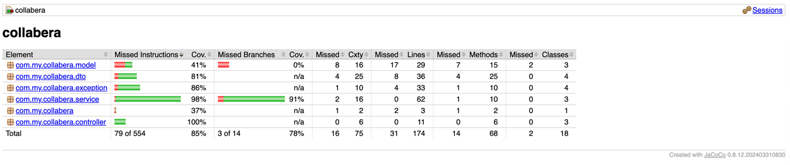

# Collabera Assessment

### Accessing Documentation

- **Swagger UI**: http://localhost:9798/swagger-ui.html
- **API Docs (JSON)**: http://localhost:9798/api-docs
- **H2 Console** (dev only): http://localhost:9798/h2-console
- **Actuator Health**: http://localhost:9798/actuator/health
- **Actuator Metrics**: http://localhost:9798/actuator/metrics

### Run Test
```shell
mvn clean test jacoco:report
```

#### Get Test Report
```shell
mvn jacoco:report
```
##### Report Path: `target/site/jacoco/index.html`



## ASSUMPTIONS & DESIGN DECISIONS

### Data Model Assumptions
1. **Borrower Email**: Must be unique (serves as natural key)
2. **Book Copies**: Multiple physical copies with same ISBN get different IDs
3. **ISBN Validation**: Books with same ISBN MUST have identical title and author
4. **One Book Per Borrower**: A single book instance can only be borrowed by one borrower at a time

### Business Logic Assumptions
1. **No Due Dates**: Simplified borrowing without due date tracking
2. **No Reservations**: No queue/reservation system for borrowed books
3. **Immediate Return**: Books are immediately available after return
4. **No Late Fees**: No penalty system implemented

### Technical Assumptions
1. **Concurrency**: Database-level constraints handle concurrent borrowing attempts
2. **Soft Deletes**: Not implemented (hard deletes assumed)
3. **Audit Trail**: Basic timestamps only (created_at, updated_at)
4. **Search**: No full-text search on books (can be added with ElasticSearch)

---

## 12-FACTOR APP COMPLIANCE

1. **Codebase**: Single repo, multiple deployments via profiles
2. **Dependencies**: Explicitly declared in pom.xml
3. **Config**: Externalized via environment variables
4. **Backing Services**: H2 as attached resource
5. **Build, Release, Run**: Maven build, Docker image, container run
6. **Processes**: Stateless (no session state)
7. **Port Binding**: Self-contained with embedded Tomcat
8. **Concurrency**: Horizontal scaling via Kubernetes
9. **Disposability**: Fast startup, graceful shutdown
10. **Dev/Prod Parity**: Same stack (H2 vs PostgreSQL only difference)
11. **Logs**: Stdout streaming (captured by container runtime)
12. **Admin Processes**: Flyway migrations, actuator endpoints